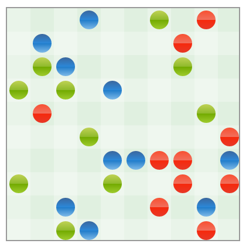

Getting started with End of Codes
=================================

Welcome to **End of Codes**! In this game for programmers, you fight against
other programmers by building programs that fight against each other. In this
tutorial, you will learn how to develop your first program to participate in the
games.

What's special
--------------
If you've participated in other contests, End of Codes is somewhat unique in the
following ways:

 * All players play against all others in every game. It's not a one-against-one
   match.
 * You can use any programming language you like, even your own. There are no
   restrictions.
 * Your programs run on your own machines. You can run them on your laptop, on
   your desktop, on your specialized hardware, on a supercomputer, or on a
   cloud.
 * All games, including the ones you have not participated in, are available to
   download. This includes their full history.

While the focus of the competition revolves around artificial intelligence, this
unique setting allows contestants to gain a competitive advantage by employing
all sorts of skills:

 * ***Artificial intelligence***: Improve your game by improving your strategy
   heuristics.
 * ***Machine learning***: Use learning techniques to make your programs learn from
   past games. You can use historical games as your training set.
 * ***Programming languages***: As the platform is not restrictive about which
   programming language you can use, you can develop domain-specific languages
   to tackle particular problems in more extensible ways.
 * ***Algorithms***: Certain parts of the game may be solvable using algorithmic
   techniques. Probabilistic and approximation methods can be appropriate,
   although certain parts such as end-of-game situations may be solvable with
   complete correctness.
 * ***Hardware***: As your programs run on your own computers, you can work on
   assembling a network of computers to do the computations for you, or work on
   specialized hardware if you're a hardware hacker.
 * ***Parallel computing***: We allow you to run your programs on multiple
   computers if you like. You can leverage parallel computing abilities and
   split up the tasks through computers on your network.

The rules
---------
The rules of the game are quite simple. Let's go through them quickly.

Each player writes a program which is called a ***bot***. The game is conducted
by a program that is run by us, called the ***grader***. The bot is an HTTP
service. The grader starts the game and makes HTTP requests to each bot to ask
it how it wants to move.

The game is a strategy game in 2D space. Each bot controls a number of creatures
in space. Here is a typical game setup with three players:

You can see the creatures as bubbles on the grid. Each creature is on its own
location - two creatures cannot share the same location. Each creature has a
color, indicating a player. For example, all red creatures belong to the same
bot.

Each creature has a ***location***, given by non-negative integers x and y, and
***hit points***, given by a positive number. Creatures can move around the map
and attack each other. Each attack deals a damage of 1 hit point on the defender. Once a
creature reaches zero hit points, it dies and no longer participates in the
game.

The purpose of the game is to be the last man standing: To eliminate the
creatures owned by all other players, while keeping your own alive.

The game is split into ***rounds***. A round is a discrete moment in time.

The first round is called ***genesis***. At genesis, the locations of creatures
are randomized by the grader. In each round, you are asked what your creatures
will do.

For each creature, you can choose for it to remain standing where it
is, to move to an empty neighbouring location, or to attack a neighbouring
creature. Neighbouring locations are north, east, south, and west, but not
diagonal. Once you declare an attack on an enemy creature, it will take damage,
regardless of whether it tries to move. If two creatures attack each other at
the same time, both will take damage. This means that they can die
simultaneously. If multiple creatures attack a single victim, the victim will
take more damage, up to 4 hit points per round if it is surrounded. If two
creatures try to move to the same location, they will be both bounced back to
their previous locations.

That's it about the rules. If you want to view our precise rules, you can
[refer to our specification](https://github.com/dionyziz/endofcodes/blob/master/SPECIFICATION.md#overview),
although this shouldn't be necessary to make your first bot.

Now let's get to coding your first bot in PHP.

Creating your bot
-----------------
We'll show you how to create a bot in PHP. We're currently developing libraries
for C/C++ and Python to make it easier for players to play. If you plan to use C
or C++, you can use cgi behind a web server. If you use python, you can use
bottle. If you use ruby, you can use sinatra or rails.

We're also planning to develop a protocol that eliminates the need for players
to port forward. However, for now, you must either enable port forwarding on
your local network, or have an open network computer, such as a server.

We have prepared [a sample
bot](https://github.com/dionyziz/endofcodes/tree/master/bots/php) that you can use to get started.
Start by making a copy of the sample bot: Place the files to your www root. You
will need to copy all 4 files: `.htaccess`, `bot.php`, `game.php`, and
`round.php`. `.htaccess` assumes you are running Apache and that mod_rewrite is
installed.

Next, edit the file `bot.php` and put in a bot name in place of "sample_bot" -
this can be whatever you like. The version field indicates the version of your
bot and can also be whatever you like. You can leave it at "0.1.0" for now. Most
importantly, edit your username to match the username of the account that you
have on endofcodes.com.

When you have done this, visit the external URL where your bot lives on, on the URI
`/bot` and make sure it responds with a JSON string including your username. The
URL must be accessible from the Internet. For example, it can be
`http://example.com/endofcodes/mybot/bot`. Make sure that visiting this URL
shows the expected JSON data and returns a 200 HTTP OK response.

Configuring your account
------------------------
Now, make sure you create an account on
[endofcodes.com](http://endofcodes.com). Then go to your settings page and
change your bot URL to the one you've created. You're ready to play! Games take
place every day at 18:00 (GMT+2).

Modifying your bot
------------------
The sample bot is quite stupid. The basic game logic is written in `round.php`,
which you can edit. The bot behaves as follows:

 * If a creature can attack, make it attack.
 * If a creature cannot attack, make it randomly either stay in place or move
   towards a random direction.

You will notice that the bot plays by returning a JSON response which encodes a
list of intents. You can [read our whole
protocol
specification](https://github.com/dionyziz/endofcodes/blob/master/SPECIFICATION.md#bot-api)
if you like, although this shouldn't be necessary to make changes.

Once you modify your bot, go back to the settings page and resubmit your URL to
make sure it behaves correctly at a basic level.

See you on the playing field!
